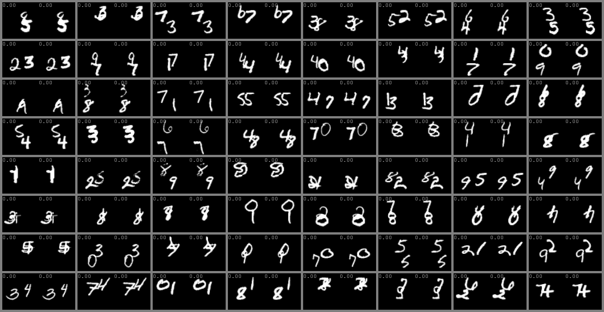

<h1 align="center"> A unified model for conditional video synthesis </h1>

<h3 align="center"> <a href="https://github.com/NPVS/NPVS" target="_blank">Code</a> <h3>

&nbsp;

<h2 align="left"> Uncurated Examples of the unifed model for each task of VFI, VFP, VPE and VRC </h2>

we show prediction examples of 1X fps (original fps of the dataset), 2X fps and 3X fps. 2X fps and 3X fps show the continuous prediction ability of our unified model. <em>Frames with  Red temporal coordinates  denote frames generated by our model.</em>

<h3 align="left">  Video interpolation (VFI) </h3>

<em><b>1X fps</b></em> 

left column: ground-truth. Right column: predicted videos

<h3 align="center">  </h3>

<em><b>2X fps</b></em> (Ground-truth is not available) 

<h3 align="center">  </h3>

<em><b>3X fps</b></em> (Ground-truth is not available) 

<h3 align="center">  </h3>

&nbsp;

<h3 align="left"> Video future prediction (VFP) </h3>

<em><b>1X fps</b></em> 

left column: ground-truth. Right column: predicted videos 

<h3 align="center">  </h3>

<em><b>2X fps</b></em> (Ground-truth is not available) 

<h3 align="center">  </h3>

<em><b>3X fps</b></em> (Ground-truth is not available) 

<h3 align="center">  </h3>

&nbsp;

<h3 align="left"> Video past frame extrapolation (VPE) </h3>

<em><b>1X fps</b></em> 
left column: ground-truth. Right column: predicted videos 

<h3 align="center">  </h3>

<em><b>2X fps</b></em>  (Ground-truth is not available)

<h3 align="center">  </h3>

<em><b>3X fps</b></em>  (Ground-truth is not available)

<h3 align="center">  </h3>

&nbsp;

<h3 align="left"> Video random missing frames completion (VRC) </h3>

<em><b>1X fps</b></em> 

left column: ground-truth. Right column: predicted videos 

<h3 align="center">  </h3>

<em><b>2X fps</b></em> (Ground-truth is not available) 

<h3 align="center">  </h3>

<em><b>3X fps</b></em> (Ground-truth is not available)

<h3 align="center">  </h3>

&nbsp;

<h3 align="left"> VRC with mixing fps (Irregular time step, Ground-truth is not available)
</h3>

Some missing frames are predicted with 1X fps, some missing frames are predicted with 2X fps, some missing frames are predicted with 3X fps.

<h3 align="center">  </h3>

&nbsp;

<h3 align="left"> Uncurated Examples of task-specific VFI
</h3>

<em>Frames with Red temporal coordinates denote frames generated by our model.</em>

<h3 align="left"> KTH and SM-MNIST (64x64) </h3>

left column: ground-truth. Right column: predicted videos. 

<h3 align="center">  </h3>

<h3 align="center">  </h3>

<h3 align="left"> BAIR (64x64)  </h3>

left column: ground-truth, middle column: random prediction 1, right column: random prediction 2. 

<h3 align="center">  </h3>

&nbsp;

<h3 align="left"> Uncurated Examples of task-specific VFP </h3>

<em>Frames with Red temporal coordinates denote frames generated by our model.</em>

<h3 align="left"> KTH (64x64) </h3>

left column: ground-truth. Right column: predicted videos. 

<h3 align="center">  </h3>

<h3 align="left"> Cityscapes (128x128) </h3>

left column: ground-truth, right column: predicted videos.

<h3 align="center">  </h3>

<h3 align="left"> BAIR (64x64) </h3>

left column: ground-truth, middle column: random prediction 1, right column: random prediction

<h3 align="center">  </h3>

