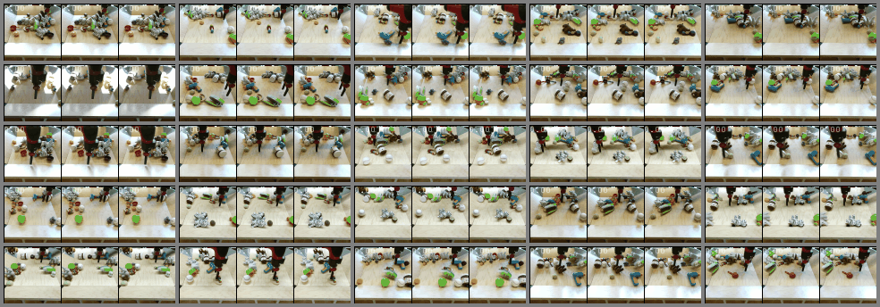
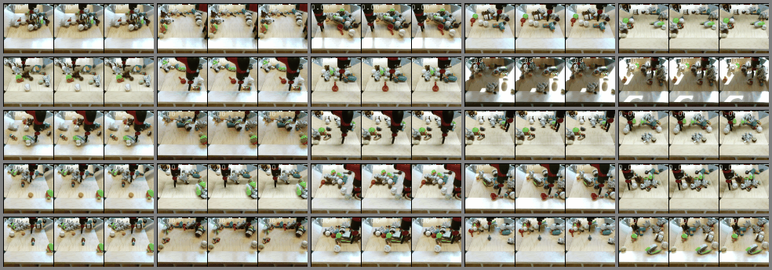

<h1 align="center"> A unified model for conditional video synthesis </h1>

<h3 align="center"> <a href="https://github.com/NPVS/NPVS" target="_blank">Code</a> <h3>

# Uncurated Examples of the unifed model
For each task of VFI, VFP, VPE and VRC, we show prediction examples of 1X fps (original fps of the dataset), 2X fps and 3X fps. 2X fps and 3X fps show the continuous prediction ability of our unified model. <em>Frames with **Red temporal coordinates** denote frames generated by our model.</em>

## Video interpolation (VFI)
### **1X fps**
left column: ground-truth. Right column: predicted videos

### **2X fps** (Ground-truth is not available)

### **3X fps** (Ground-truth is not available)

## Video future prediction (VFP)
### **1X fps**
left column: ground-truth. Right column: predicted videos

### **2X fps** (Ground-truth is not available)

### **3X fps** (Ground-truth is not available)

## Video past frame extrapolation (VPE)
### **1X fps**
left column: ground-truth. Right column: predicted videos

### **2X fps** (Ground-truth is not available)

### **3X fps** (Ground-truth is not available)

## Video random missing frames completion (VRC)
### **1X fps**
left column: ground-truth. Right column: predicted videos

### **2X fps** (Ground-truth is not available)

### **3X fps** (Ground-truth is not available)

### **VRC with mixing fps (Irregular time step, Ground-truth is not available)**
Some missing frames are predicted with 1X fps, some missing frames are predicted with 2X fps, some missing frames are predicted with 3X fps.

# Uncurated Examples of task-specific VFI

### KTH and SM-MNIST (64x64)

left column: ground-truth. Right column: predicted videos. <em>Frames with **Red temporal coordinates** denote frames generated by our model.</em>

&nbsp;
### BAIR (64x64)
left column: ground-truth, middle column: random prediction 1, right column: random prediction 2. <em>Frames with **Red temporal coordinates** denote frames generated by our model.</em>

# Uncurated Examples of task-specific VFP

### KTH (64x64)

&nbsp;

### BAIR (64x64)
left column: ground-truth, middle column: random prediction 1, right column: random prediction 2. <em>Frames with **Red temporal coordinates** denote frames generated by our model.</em>

